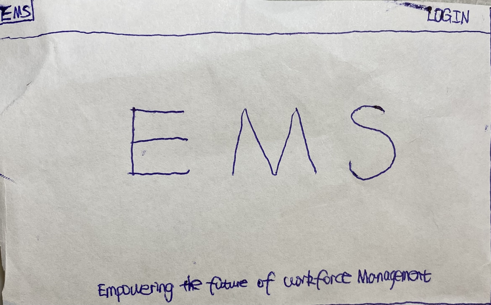
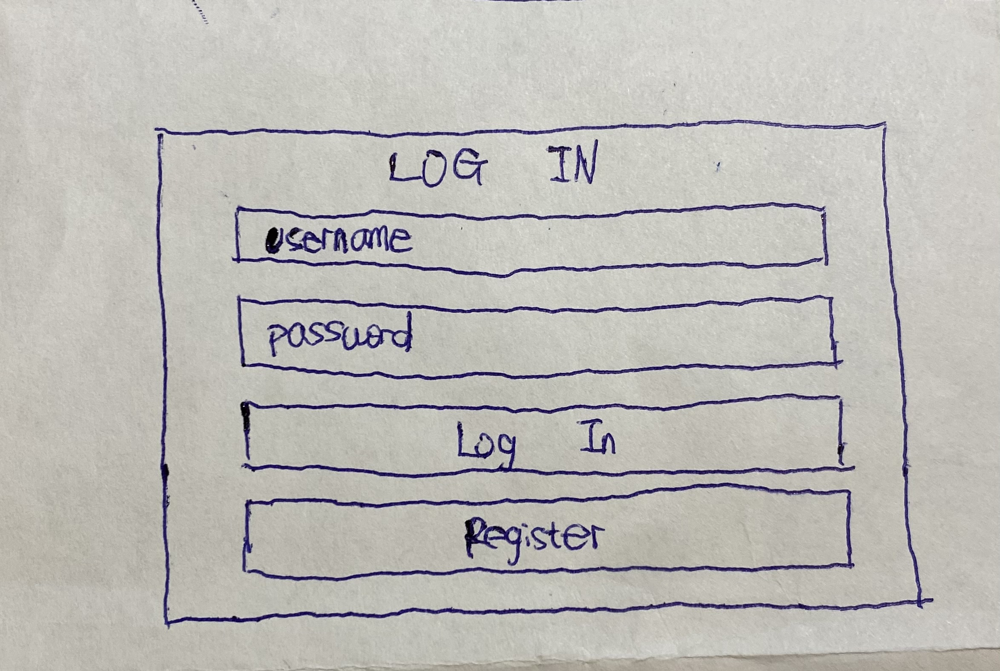
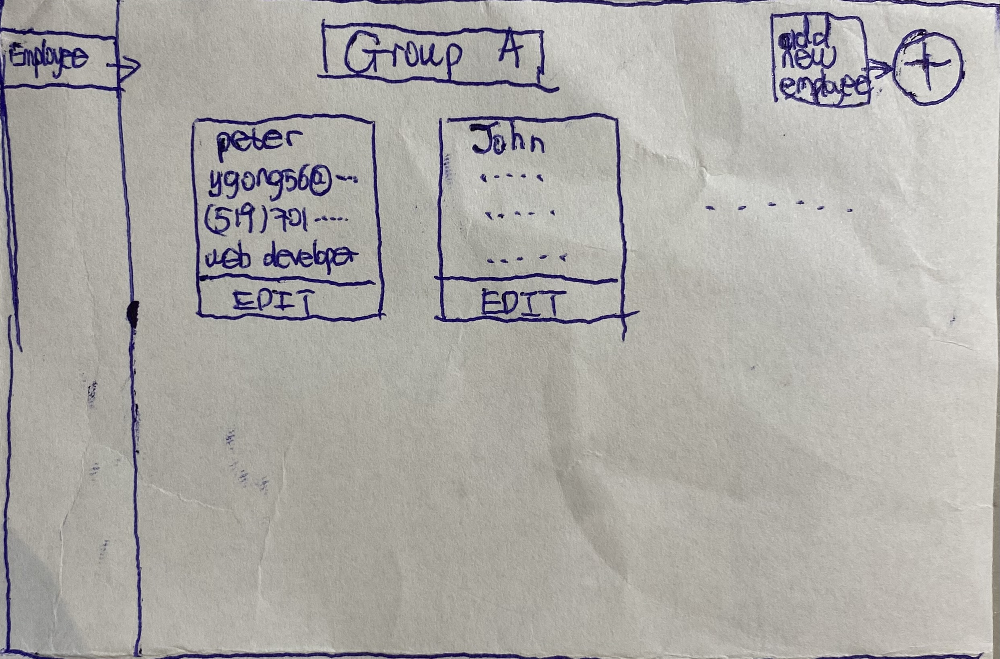
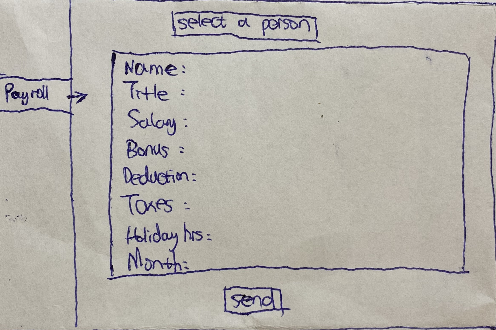
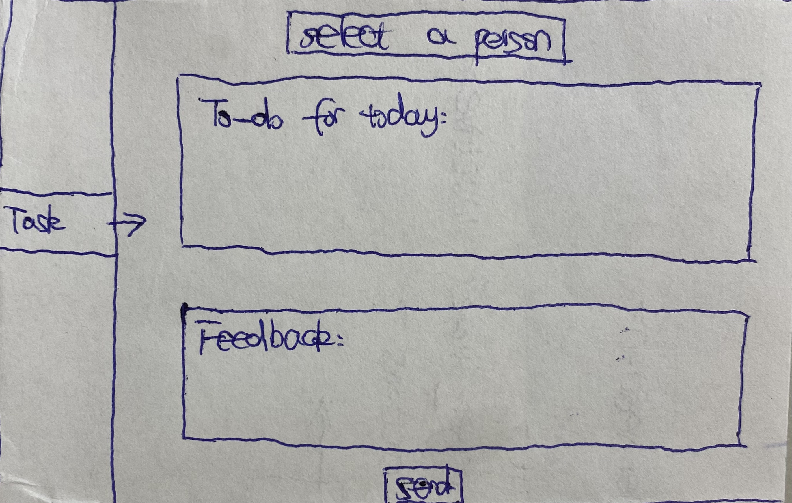
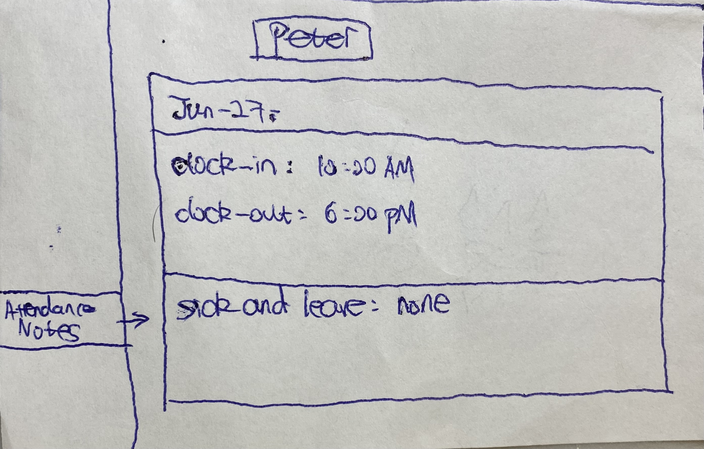
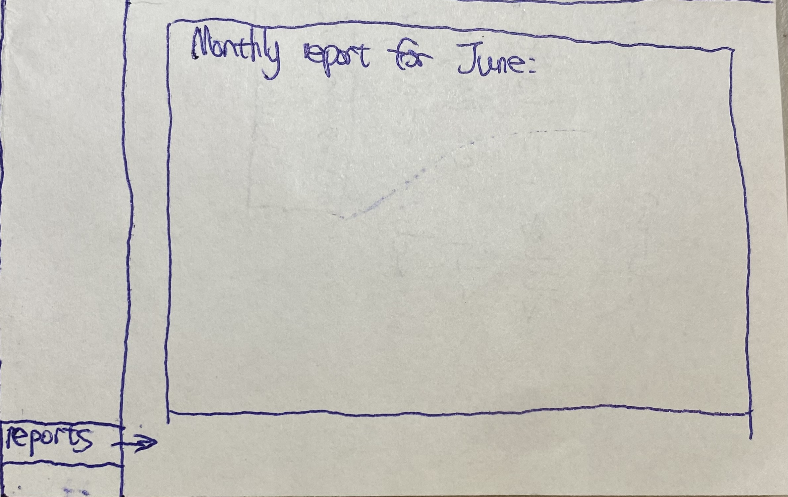

# Project Title
Employee Management System

## Overview

Employee Management System is a website that can help a company keep organized with its employees.

### Problem

Employee Management System is a website that can help a company keep organized with its employees. Most companies have to use different apps to manage attendance, payroll, tax, sick and leave notes, tasks, performance and reports. With Employee Management System, a company can handle all these tasks in just one place.

### User Profile

- Companies:
    - that want to keep organized with everything related to employees to be  found in one app.

### Features

- As a user, I want to be able to create an account to manage my employees.
- As a logged in user, I want to be able to see all my employees' profiles including managers'.
- As a logged in user, I want to be able to divide employees into different group with different duties.
- As a logged in user, I want to be able to write payroll and tax slips.
- As a logged in user, I want to be able to assign tasks and provide feedbacks.
- As a logged in user, I want to be able to receive attendance, notes and reports.

## Implementation

### Tech Stack

- React
- MySQL
- Express
- Client libraries: 
    - react
    - react-router
    - react-router-dom
    - axios
    - sass
    - react-resizable
    - react-rnd
    - antd
- Server libraries:
    - knex
    - express
    - bcrypt for password hashing
    - jsonwebtoken
    - mysql2
    - cors

### APIs

- No external APIs will be used for the first sprint

### Sitemap

- Home page
- List employees
- Write payroll, tax, tasks, feedbacks
- Review notes and reports
- Register
- Login

### Mockups

#### Home Page (h4)



#### Register Page
<!--  -->

#### Login Page


#### Employees Page


#### Payroll Page


#### Tax Page
<!--  -->

#### Task and Feedback Page


#### Attendance and Notes Page


#### Reports Page



### Endpoints

**GET /companies**

Parameters:

Response:
```
[
    {
       "company_name": "Peter's company"
    },
    ...
]
```

**GET /teams**

Parameters:

Response:
```
{
    "company_id": "1",
    "team_name": "Managers' Zone"
}
    ...
```

**GET /members**

Parameters:

Response:
```
{
    "company_id": "1",
    "team_id": "1",
    "username": "peter123",
    "password": "123456",
    "member_name": "Peter",
    "member_title": "manager",
    "member_email": "peter@gmail.com",
    "member_phone": "6135393902",
    "member_address": "123 St."
}
    ...
```

**POST /members**

Parameters:

Response:
```
{
    "company_id": "1",
    "team_id": "1",
    "username": "peter",
    "password": "123",
    "member_name": "Peter",
    "member_title": "junior developer",
    "member_email": "peter@gmail.com",
    "member_phone": "911",
    "member_address": "123 St."
}
    ...
```

**PUT /members/:id**

Parameters:
- id: member id

Response:
Response:
```
{
    "company_id": "1",
    "team_id": "1",
    "username": "peter",
    "password": "123",
    "member_name": "Peter",
    "member_title": "junior developer",
    "member_email": "peter@gmail.com",
    "member_phone": "911",
    "member_address": "123 St."
}
    ...
```


<!-- ### Auth

- JWT auth
    - Before adding auth, all API requests will be using a fake user with id 1
    - Added after core features have first been implemented
    - Store JWT in localStorage, remove when a user logs out
    - Add states for logged in showing different UI in places listed in mockups -->

## Roadmap

- Create client
    - react project with routes and boilerplate pages

- Create server
    - express project with routing, with placeholder 200 responses

- Create migrations

<!-- - Gather 15 sample café geolocations in two different cities -->

<!-- - Create seeds with sample café data -->

- Deploy client and server projects so all commits will be reflected in production

- Feature: List all teams
    - Create GET /teams endpoint

- Feature: List all members
    - Create GET /members endpoint

- Feature: Add a new team
    - Create post /teams endpoint

- Feature: Add a new member
    - Create post /members endpoint

- Feature: Edit member's info
    - Create PUT /members

- Feature: Switch team
    - Create PUT /teams

- Feature: Home page

- Feature: Create account
    - Implement register page + form
    - Create POST /members endpoint

- Feature: Login
    - Implement login page + form
    - Create POST /members endpoint

<!-- - Feature: Implement JWT tokens
    - Server: Update expected requests / responses on protected endpoints
    - Client: Store JWT in local storage, include JWT on axios calls -->

- Bug fixes

- DEMO DAY

## Nice-to-haves

<!-- - Integrate Google Places / Maps
    - View more details about a café
    - Visual radius functionality
- Forgot password functionality
- Ability to add a café 
- Elite status badging for users and cafés: Gamify user ratings
- Expand rating system
    - Coffee
    - Ambiance
    - Staff
- Expanded user information: full name, favorite café
- Unit and Integration Tests -->

